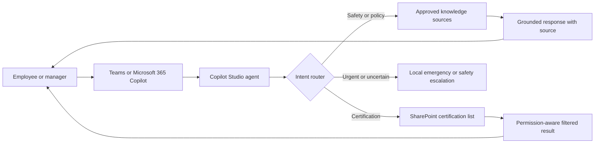

# Safety Assistant Agent

A privacy-safe reference implementation of a workplace safety and equipment-certification assistant built with Microsoft Copilot Studio, Microsoft 365, Teams, and SharePoint.

This repository demonstrates the architecture, prompt design, routing rules, and data contract behind the project without publishing any employer data, internal policies, employee records, tenant identifiers, credentials, or production connection details.

> [!IMPORTANT]
> This is a sanitized portfolio project, not a deployable copy of a production agent. It does not provide legal or safety advice. Any real deployment must use organization-approved procedures, access controls, emergency contacts, and review by qualified safety personnel.

## What It Demonstrates

- Grounded safety Q&A using approved internal documents with public regulatory sources as supplemental material
- Natural-language certification lookups backed by a SharePoint list
- Intent routing between policy questions, equipment inventory questions, and employee certification questions
- Exact-match and team-scoping rules for sensitive employee records
- Safety-first responses for urgent scenarios and explicit escalation when sources are incomplete
- Standard conversation handling for greetings, fallback, escalation, and errors

## Architecture



See [Architecture](docs/ARCHITECTURE.md) for the component and trust-boundary details.

## Repository Layout

```text
.
|-- docs/
|   |-- ARCHITECTURE.md
|   `-- PRIVACY.md
|-- examples/
|   `-- agent-instructions.md
|-- src/
|   |-- actions/
|   |-- topics/
|   |-- agent.mcs.yml
|   |-- connectionreferences.example.mcs.yml
|   `-- settings.mcs.yml
|-- LICENSE
|-- SECURITY.md
`-- README.md
```

The `src` files are representative Copilot Studio configuration excerpts. Tenant-specific IDs and connection names are placeholders, and the files are intended for review and adaptation rather than direct import.

## Core Design Decisions

1. **Internal policy wins.** Approved organizational procedures take precedence over public regulatory references when both address the question.
2. **Urgency changes the response.** Immediate actions and local escalation appear before background information for emergencies.
3. **Sensitive data is narrowly scoped.** Certification results must be limited to authorized records and exact identity matches.
4. **The assistant does not guess.** Missing or conflicting sources produce a clear limitation and escalation path.
5. **Inventory and certification are different intents.** A question about available equipment is not treated as a question about who may operate it.

## Adapting The Reference

1. Create a Copilot Studio agent in your own Microsoft environment.
2. Replace every `YOUR_*` placeholder with values from that environment.
3. Add only approved safety documents and verify their access permissions.
4. Configure a SharePoint connector using least-privilege access.
5. Implement server-side or connector-level authorization for employee data; prompt instructions alone are not an access-control boundary.
6. Review emergency wording, escalation contacts, and sample answers with qualified safety and privacy stakeholders.
7. Test identity matching, duplicate names, denied access, stale records, missing sources, and connector failure before publishing.

## Privacy

The public repository was created as a clean-room representation. Production exports, organization names, tenant URLs, list IDs, connection IDs, internal document titles, employee names, contact details, and branded assets are intentionally excluded. See [Privacy](docs/PRIVACY.md).

## License

Released under the [MIT License](LICENSE).
